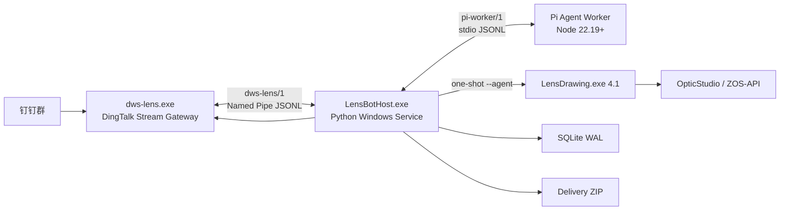
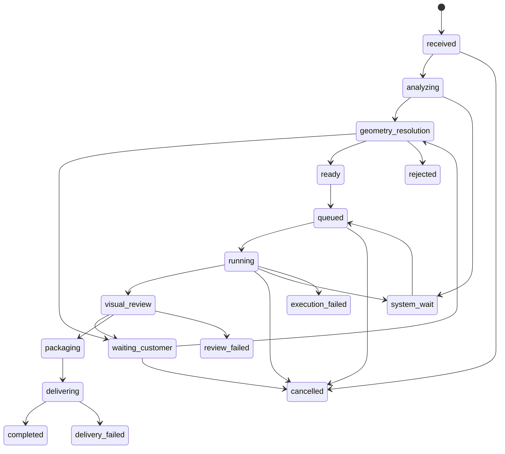

# Lens Drawing 钉钉自动出图 Agent 部署与构建方案

状态：执行版
日期：2026-08-18
执行主体：目标 Windows 电脑上的 Codex
生产目标：内部技术人员通过钉钉机器人提交 ZMX 与加工要求，系统自动分析、澄清、出图、轻量视觉检查、打包并以机器人身份回传文件。

## 1. 结论摘要

首期采用一个 Windows 服务统一监督三个子进程：扩展后的 DWS Gateway、Pi Agent Worker 和一次性 Lens Drawing Agent CLI。只有 DWS Gateway 与宿主之间使用 Windows Named Pipe；Pi Worker 由宿主直接启动并使用 stdin/stdout JSONL，减少一个常驻服务和一条命名管道。



核心原则：

1. Lens Drawing 继续负责 ZOS-API、确定性几何映射、参数校验、PDF 渲染和 PDF 自动校验，不在宿主重复实现光学逻辑。
2. Pi Agent 负责理解用户语言、整理命名和加工要求，并在 Lens Drawing 生成的有限几何候选之间判断虚拟胶合面及 AD/MD 归属；它不能填写候选之外的数值，也不拥有文件系统、Shell、编码工具或最终审图签核工具。
3. `#状态`、`#取消`、`#重试`、文件回执、排队、投递和幂等完全由 Python 宿主处理，不消耗模型调用。
4. 正常任务不经过人工逐单签核。确定性校验和轻量视觉检查通过后自动完成、打包和投递；只有缺信息、冲突或不支持的真实几何才通过 DWS 询问内部技术人员。
5. Lens Drawing 4.1 必须先在本机完成源码改造、测试和 release 构建，目标机只接收其 release 包，不接收 Lens Drawing 源码。DWS、宿主和 Pi Worker 由目标机 Codex 按本方案创建、构建和部署。

## 2. 已验证基线与版本冻结

### 2.1 当前 Lens Drawing 基线

- Git 基线：`456ae3a`，分支 `codex/lens-drawing-v4-agent`。
- Lens Drawing：`4.0.0`。
- Agent Interface：`4.0.0`。
- Request Schema：`1.1`。
- Task Schema：`1.0`。
- 当前 72 项单元/契约/渲染测试已通过。
- 当前安装版 `LensDrawing.exe --agent spec` 已验证可输出版本化 JSON envelope。
- 当前支持：Sequential、单配置、1–3 片、Standard 球面或平面；支持虚拟胶合界面、两侧独立 AD、H-K9L 双平面棱镜剔除。

### 2.2 需要发布的新接口版本

自动机器审图和部署级加工默认策略会改变任务状态及审计语义，不能继续冒用 V4.0 接口。目标版本固定为：

| 契约 | 当前 | 目标 |
|---|---:|---:|
| Lens Drawing | 4.0.0 | 4.1.0 |
| Agent Interface | 4.0.0 | 4.1.0 |
| Request Schema | 1.1 | 1.2 |
| Task Schema | 1.0 | 1.1 |
| LensBot Host | 无 | 1.0.0 |
| DWS Lens Protocol | 无 | `dws-lens/1` |
| Pi Worker Protocol | 无 | `pi-worker/1` |

旧的 4.0 任务目录不得由 4.1 自动迁移后继续生产运行。若目标机上存在未完成 4.0 任务，保留原安装版完成或重新创建 4.1 任务。

### 2.3 外部源码冻结

| 组件 | 固定版本/提交 | 构建要求 |
|---|---|---|
| DWS | `DingTalk-Real-AI/dingtalk-workspace-cli@effde762277ad717a246e38b237a8297fa49aab7` | Go `1.25.9` |
| Pi | `earendil-works/pi@v0.84.2`，提交 `914cf1472e715297caa30db4b9535d534a9eb718` | Node `>=22.19.0` |
| `@earendil-works/pi-agent-core` | `0.84.2`，精确版本 | 生产依赖 |
| `@earendil-works/pi-ai` | `0.84.2`，精确版本 | 生产依赖 |
| Python | `3.12.10` | 仅构建宿主；运行时随 EXE 打包 |

不自动跟随 DWS `main`、Pi 新版本或模型别名变化。升级必须重新执行协议测试、模型探针和端到端验收。

## 3. 对初稿的必要修正

### 3.1 DWS 文件投递

当前 DWS 源码已经支持：

```text
dws chat message send-by-bot --robot-code ... --conversation-id ... --msg-type file --file-path ...
```

因此首期固定使用同一企业机器人身份发送 ZIP，不设计“机器人失败后静默改用实体账号”的双路径。DWS Gateway 直接复用现有本地文件上传和 `send_robot_group_message` 路径，失败时向宿主返回结构化错误。

### 3.2 Pi ResourceLoader

Pi `ResourceLoader` 属于 `@earendil-works/pi-coding-agent`，不是 `pi-agent-core`。为了不引入编码提示、Shell、文件编辑器及额外依赖，首期不安装 `pi-coding-agent`。

Pi Worker 自己实现一个很小的 `LensSkillLoader`：

1. 只读取安装包内固定路径的 `skills/lens-drawing-agent/SKILL.md`。
2. 递归读取白名单中的两个 references 文件和生成的 spec JSON。
3. 启动时校验所有文件 SHA-256 与发布 manifest 一致。
4. 将内容拼入固定 system prompt；不扫描用户目录、`.pi`、`AGENTS.md`、编码 prompt 或其他 Skill。

### 3.3 机器视觉审图必须有真实审计类型

当前 V4 把 `human_visual_review_required=true`、`review_kind=human_operator` 和 `awaiting_human_review` 写死。生产版不得让模型结果伪装成人工签核。

4.1 改为：

- `execution.visual_review.mode`：`vision_agent` 或 `human_operator`。
- 默认生产模式：`vision_agent`。
- `review` 命令新增 `--kind vision_agent|human_operator` 和 `--report <json>`。
- 机器审图写入 `visual_review.json`，其中真实记录模型、提示版本、图片哈希、PDF 哈希、耗时、问题列表和最终决策。
- Pi 主 Agent 不注册 `review` 工具；由 Python 宿主在验证 VisionReviewer 结构化结果后调用 CLI。
- 保留 `human_operator` 模式供临时排障，但不进入正常生产流程。

### 3.4 加工默认值改为部署级批准

V4 要求每个任务都取得一次“完整默认加工要求已批准”的用户证据，这与无人值守目标冲突。4.1 新增安装级 `deployment_policy.json`：

- 固定当前 Agent 默认加工要求。
- 包含 `policy_id`、版本、批准范围和 SHA-256。
- 每个任务创建时复制只读快照并锁定哈希。
- 未被用户明确覆盖的字段直接使用该策略，不再逐单询问“是否使用默认值”。
- 用户提出的特殊加工要求仍必须映射到当前 spec 字段，并保留原消息或附件证据。

## 4. 目标机部署要求

### 4.1 已确认的同构环境

目标机环境与本机一致，方案以本机 2026-08-18 的实测值为基线：

| 项目 | 已确认值 |
|---|---|
| Windows | 注册表标识 `Windows 10 Pro 25H2`，x64，Build `26200.8037` |
| Python 构建环境 | `3.12.10` |
| Node 构建环境 | `24.15.0`，满足 Pi 的 `>=22.19.0` 要求 |
| Go | 本机当前未安装；目标机 Codex 构建 DWS 时安装 `1.25.9` |
| OpticStudio | `C:\Program Files\Ansys Zemax OpticStudio 2022 R2.01` |
| ZemaxRoot | `C:\Users\Administrator\Documents\Zemax` |
| ZOS-API | 原生 `pythonnet + ZOSAPI_NetHelper.dll` |
| 许可证 | `PremiumEdition` |

本机 live probe 已实际完成：`CreateNewApplication()` 成功，加载官方 `2- Singlet.zmx`，读取到 `Sequential`、`Millimeters`、单配置、5 个 surface，随后关闭且未保存源文件。

### 4.2 目标机安装后复验

目标机仍要在实际服务账号下重复同一 probe，因为“电脑环境一致”不等于 Windows 服务账号的 HKCU 和许可证上下文自动一致。服务默认使用安装并激活 OpticStudio 的固定账号，不使用 `LocalSystem`。

`preflight.json` 记录：

- OS Build 和服务账号 SID。
- OpticStudio、ZemaxRoot 和三个 ZOS-API DLL 的实际路径。
- `CreateNewApplication()`、`IsValidLicenseForAPI` 和 `LicenseStatus`。
- 只读样本的模式、单位、配置数、surface 数及源文件 SHA-256。

若服务上下文失败，先修正服务账号或显式路径；不改用脱离 OpticStudio 的文本解析器作为生产替代。

## 5. 安装目录与数据目录

```text
C:\Program Files\LensBot\
  host\LensBotHost.exe
  host\_internal\...
  gateway\dws-lens.exe
  agent\node.exe
  agent\agent-worker.mjs
  agent\agent-worker.manifest.json
  lensdrawing\LensDrawing.exe
  lensdrawing\agent_resources\...
  lensdrawing\skills\lens-drawing-agent\...
  config-templates\lensbot.toml
  config-templates\deployment_policy.json
  scripts\Install-LensBot.ps1
  scripts\Configure-LensBot.ps1
  scripts\Test-LensBot.ps1
  scripts\Uninstall-LensBot.ps1

C:\ProgramData\LensBot\
  config\lensbot.toml
  config\deployment_policy.json
  config\secrets.dpapi
  db\lensbot.db
  gateway-spool\
  tasks\<task_id>\
  deliveries\<task_id>_<lens_model>\
  logs\host.jsonl
  logs\gateway.jsonl
  logs\agent.jsonl
  health\status.json
```

首期不做自动删除，`retention_days=0` 表示永久保留，避免加入删除墓碑和清理恢复逻辑。空间策略在真实运行量明确后再增加。

## 6. DWS Gateway 最小扩展

### 6.1 修改边界

从冻结的 DWS 提交创建 `codex/lensbot-gateway` 分支，只做以下变化：

1. 增加 `dws lens connect` 命令。
2. 复用现有 DingTalk Stream、快速 ACK、自动重连、群/用户白名单、附件发现和附件下载实现。
3. 将回调转换成 `dws-lens/1` 事件，写入简单磁盘 spool 后发送到 Named Pipe。
4. 增加 Named Pipe 出站命令处理，复用现有机器人 Markdown、引用回复和本地文件发送实现。
5. 不修改 DWS 其他命令和用户认证实现。

### 6.2 Named Pipe

固定地址：

```text
\\.\pipe\lensbot-gateway-v1
```

Python 宿主是 Pipe Server，DWS 是自动重连的 Pipe Client。Pipe ACL 只允许服务账号和 Administrators。每行一个 UTF-8 JSON，单帧最大 4 MiB。

### 6.3 握手

```json
{"v":"dws-lens/1","type":"hello","gateway_version":"1.0.0","dws_commit":"effde762277ad717a246e38b237a8297fa49aab7","robot_code":"robot-code","pid":1234}
```

宿主必须校验 `v`、冻结提交和 robot code，再返回：

```json
{"v":"dws-lens/1","type":"hello_ok","host_version":"1.0.0"}
```

### 6.4 入站事件

```json
{
  "v": "dws-lens/1",
  "type": "inbound_message",
  "request_id": "uuid",
  "event_id": "sha256(robotCode|conversationId|msgId)",
  "msg_id": "ding-msg-id",
  "robot_code": "robot-code",
  "conversation_id": "cid...",
  "conversation_type": "2",
  "sender": {
    "staff_id": "staff-id",
    "open_dingtalk_id": "optional",
    "nick": "name"
  },
  "message_type": "text|file|richText|unknown",
  "text": "原始可读文本",
  "attachments": [
    {
      "attachment_id": "uuid",
      "original_name": "lens.zmx",
      "mime_type": "application/octet-stream",
      "size": 12345,
      "sha256": "64-hex",
      "spool_path": "C:\\ProgramData\\LensBot\\gateway-spool\\...\\lens.zmx"
    }
  ],
  "received_at": "RFC3339"
}
```

DWS 在平台 ACK 后立刻把附件移入 spool，并原子写入事件 JSON。宿主持久化消息和文件后返回：

```json
{"v":"dws-lens/1","type":"accepted","request_id":"uuid","event_id":"..."}
```

DWS 收到 `accepted` 后删除对应 spool 事件；宿主未响应时保留并在重连后重发。重复事件由宿主的 `event_id` 主键消除。

### 6.5 出站命令

文本：

```json
{"v":"dws-lens/1","type":"send_text","request_id":"uuid","conversation_id":"cid...","reply_to_msg_id":"optional","markdown":"内容"}
```

文件：

```json
{"v":"dws-lens/1","type":"send_file","request_id":"uuid","conversation_id":"cid...","file_path":"C:\\ProgramData\\LensBot\\deliveries\\...zip","display_name":"...zip"}
```

结果：

```json
{"v":"dws-lens/1","type":"send_result","request_id":"uuid","ok":true,"provider_key":"processQueryKey-or-message-id","error":null}
```

首期出站只支持机器人 Markdown 和本地文件。图片卡片、流式卡片和实体账号发送不进入生产范围。

## 7. Python 确定性宿主

### 7.1 进程模型

只安装一个 Windows Service：`LensBotHost`。宿主启动并监督：

- 一个 `dws-lens.exe lens connect` 子进程。
- 一个 `node.exe agent-worker.mjs` 子进程。
- 每次 Lens Drawing 命令启动一个 `LensDrawing.exe --agent` 子进程。

Lens Drawing 子进程放入 Windows Job Object；超时时只终止本任务的进程树，不按进程名杀死用户手工打开的 OpticStudio。

### 7.2 SQLite 表

```text
inbound_messages(event_id PK, msg_id, conversation_id, sender_id, text, received_at)
files(file_id PK, event_id, original_name, stored_path, sha256, size, created_at)
tasks(task_id PK, file_id, conversation_id, requester_id, status, lens_task_dir,
      created_at, updated_at, last_error)
task_events(seq PK, task_id, old_status, new_status, payload_json, created_at)
agent_turns(task_id, turn_no, role, content_json, created_at, PK(task_id, turn_no))
deliveries(delivery_id PK, task_id, artifact_sha256, conversation_id, status,
           provider_key, attempt_count, last_error, updated_at)
settings(key PK, value_json)
schema_migrations(version PK, applied_at)
```

SQLite 使用 WAL、`busy_timeout=5000`、单宿主写入。不要让 Node Worker 或 DWS 直接打开数据库。

### 7.3 文件处理

1. 只接受 `.zmx` 作为准确自动几何输入；扩展名大小写不敏感。
2. 宿主将 DWS spool 文件移动到 `tasks/<task_id>/input/`，使用随机存储名并保留原名元数据。
3. 再算一次 SHA-256，与 DWS 事件值一致后才建立任务。
4. 不覆盖已有路径，不运行上传文件，不调用 Windows Defender 扫描。
5. 一个消息含多个 ZMX 时，每个 ZMX 创建一个任务并继承同一条文字要求。
6. ZMX 与说明在同一条消息时直接绑定；单独上传也立即创建任务并返回文件/任务回执。

### 7.4 回执与命令

- 任务号：`LD-YYYYMMDD-HHMMSS-XXXX`。
- 文件号：`F-YYYYMMDD-XXXX`。
- 上传 ZMX 默认自动创建任务，不要求用户再发 `#出图`。
- `#出图 <文件号>` 只用于重新使用已上传但尚未绑定的文件。
- `#状态 [任务号]`：读取 SQLite 后直接返回。
- `#取消 <任务号>`：等待中的任务立即取消；运行中的任务终止本任务 Job Object 并标记取消。
- `#重试 <任务号>`：只允许 `system_wait`、`execution_failed`、`delivery_failed`。

### 7.5 状态机



每次状态变化和原因都写入 `task_events`。禁止通过聊天上下文推断状态。

### 7.6 ZOS 队列和恢复

- 全局最多一个 Lens Drawing `create` 或 `run` 命令使用 ZOS-API。
- `spec`、`status`、`submit`、`validate` 可并发，但首期实现仍按宿主命令队列串行，减少锁复杂度。
- 许可证暂不可用：当前任务进入 `system_wait`；宿主每 60 秒执行轻量 ZOS health probe，恢复后自动重新排队。
- Lens Drawing 超时：终止本任务 Job Object，自动重试一次；第二次失败进入 `execution_failed` 并通过 DWS返回错误。
- 不因为单个任务超时永久暂停全局队列。
- 宿主重启后，`running`、`visual_review`、`packaging`、`delivering` 状态按持久化产物重算下一步，不从头重复已完成命令。

## 8. Pi 主 Agent Worker

### 8.1 依赖

`package.json` 必须使用精确版本，不使用 `^` 或 `~`：

```json
{
  "type": "module",
  "dependencies": {
    "@earendil-works/pi-agent-core": "0.84.2",
    "@earendil-works/pi-ai": "0.84.2",
    "typebox": "1.3.7"
  }
}
```

提交 `package-lock.json`，构建使用 `npm ci`。生产运行时将 Worker 打包为一个 `agent-worker.mjs`，随包附带官方 Windows x64 `node.exe`；目标机不运行 npm。

### 8.2 主模型

```text
provider: volcengine-coding
api: openai-responses
baseUrl: https://ark.cn-beijing.volces.com/api/coding/v3
model: glm-5.3
input: text
thinkingLevel: max
```

### 8.3 视觉模型

```text
provider: volcengine-coding
api: openai-responses
baseUrl: https://ark.cn-beijing.volces.com/api/coding/v3
model: minimax-m3
input: text,image
thinkingLevel: max
```

方舟是否接受 OpenAI Responses 的 `reasoning.effort=max` 必须由模型探针确认。处理规则固定为：

1. 首选发送 `max`。
2. 若端点明确拒绝该参数，记录 probe 结果并改为不发送 effort，让模型使用服务端默认思考。
3. 不因为 effort 参数不兼容自动更换模型。
4. 工具调用、图片输入或 JSON Schema 任一探针失败时禁止启动生产服务。

### 8.4 Pi Worker 协议

Python 宿主启动 Worker 后，通过 stdin/stdout 使用 `pi-worker/1` JSONL。stderr 只写日志。

宿主请求：

```json
{
  "v": "pi-worker/1",
  "type": "run_agent",
  "request_id": "uuid",
  "task_id": "LD-...",
  "task_snapshot": {},
  "conversation_history": [],
  "user_evidence": []
}
```

Worker 工具调用：

```json
{
  "v": "pi-worker/1",
  "type": "tool_call",
  "request_id": "uuid",
  "tool_call_id": "id",
  "task_id": "LD-...",
  "tool": "lens_validate",
  "arguments": {}
}
```

宿主返回工具结果后，Worker 继续当前 Agent turn。Worker 每次只处理一个 `run_agent`，宿主负责排队。

### 8.5 工具白名单

主 Agent 仅注册：

| 工具 | 作用 |
|---|---|
| `lens_create` | 请求宿主对任务输入执行只读 ZMX 分析 |
| `lens_resolve_geometry` | 从 Lens Drawing 给出的候选 ID 中提交虚拟面、AD、MD 的结构化选择 |
| `lens_submit` | 提交一版 evidence-backed request |
| `lens_validate` | 执行当前请求校验 |
| `lens_enqueue_run` | 将 ready 任务加入单 ZOS 队列 |
| `lens_status` | 获取当前权威任务快照 |
| `ask_customer` | 通过宿主和 DWS 发送精确问题并进入等待状态 |
| `reject_task` | 对确定不支持或信息无效的任务给出结构化拒绝原因 |
| `emit_delivery_summary` | 生成交付摘要草稿；实际投递由宿主完成 |

`lens_resolve_geometry` 的参数只能包含 `case_id`、`candidate_id` 和判断理由，不能携带自定义 Glass/T/R/MD/AD 数值。不注册 `review`、Shell、read、write、edit、HTTP、DWS 或任意通用执行工具。

### 8.6 会话隔离

- 每个任务独立模型上下文，key 为 `task_id`。
- 不按钉钉群共享 Agent 会话。
- 宿主持久化可审计的用户/助手消息和工具结果；Worker 重启后从 `task_snapshot + agent_turns` 重建。
- 不依赖模型隐藏思考或内存来恢复任务。
- 上下文只包含当前任务、当前 spec、固定 Skill 和当前用户证据。

## 9. Lens Drawing 4.1 接口改造

### 9.1 版本与资源

修改并重新生成：

- `app_version.py`
- `agent_resources/agent_request.schema.json`
- `agent_resources/lens_drawing_agent_spec.json`
- `agent_resources/AGENT_PROTOCOL.md`
- `skills/lens-drawing-agent/**`
- `agent_resources/build_manifest.json`
- 安装包中的同步副本

### 9.2 两阶段几何接口

`create` 仍负责一次性只读打开 ZMX、保存已求值 surface 数据并生成候选，但不再要求 mapper 在存在多个合理归属时立即猜一个答案。

新增命令：

```powershell
LensDrawing.exe --agent --output-json create.json create INPUT.zmx TASK_DIR
LensDrawing.exe --agent --output-json resolve.json resolve-geometry TASK_DIR geometry-decision.json
```

`create` 必须写出：

```text
source_analysis/extracted_system.json
source_analysis/geometry_cases.json
source_analysis/drawing_drafts.json
source_analysis/analysis_summary.json
```

`geometry_cases.json` 只包含来自 ZOS-API 的有限候选：

- 胶合组和虚拟界面候选。
- 每片玻璃的左右物理 boundary surface。
- 每个 AD 候选的 surface、来源类型、原始半径和换算后全直径。
- 每个 MD 候选的 surface、MEMA 原值、solve 类型和换算后全直径。
- `MD >= max(AD_left, AD_right)` 等硬约束结果。
- 已被代码排除的候选及排除理由。

没有虚拟面的普通唯一高置信候选由 Lens Drawing 自动锁定。任何虚拟界面候选即使只有一个，也进入 `awaiting_geometry_resolution`，由主 Agent 在本次需求分析调用中确认；多个可行 MEMA 归属或中等置信字段同样进入该状态，不额外增加一个独立模型调用。

Agent 提交的 decision 只选择候选 ID：

```json
{
  "schema_version": "1.0",
  "task_id": "LD-...",
  "cases": [
    {
      "case_id": "case-1",
      "topology_candidate_id": "topology-2",
      "field_selections": {
        "group.1.lens.1.AD_right": "ad-surface-3",
        "group.1.lens.2.AD_left": "ad-surface-4",
        "group.1.lens.1.MD": "md-surface-3",
        "group.1.lens.2.MD": "md-surface-4"
      },
      "reason": "GLAS interval、零厚度重复界面和两侧 MEMA 分别对应相邻物理镜片。"
    }
  ]
}
```

`resolve-geometry` 必须拒绝未知候选、遗漏字段、候选数值变更、AD 当 MD、MD 小于任一侧 AD、非零厚度伪胶合或不匹配曲率的虚拟面。成功后才生成权威 `drawing_drafts.json`。

### 9.3 Request Schema 1.2

`execution` 目标结构：

```json
{
  "mode": "production",
  "renderer_root": "locked-installed-root",
  "automated_pdf_validation": true,
  "visual_review": {
    "required": true,
    "mode": "vision_agent"
  }
}
```

加工要求批准结构增加：

```json
{
  "approval_source": "deployment_policy",
  "policy_id": "lensbot-defaults-2026-08",
  "policy_sha256": "64-hex"
}
```

### 9.4 Task Schema 1.1

正常 Lens Drawing 内部流程改为：

```text
analyzing_geometry -> awaiting_geometry_resolution -> needs_input -> submitted -> ready -> running -> awaiting_visual_review -> completed
```

失败状态改为通用名称：

```text
blocked_geometry
geometry_resolution_failed
needs_clarification
validation_failed
execution_failed
visual_review_failed
release_blocked
```

### 9.5 Review 命令

```powershell
LensDrawing.exe --agent --output-json result.json review TASK_DIR `
  --status passed `
  --kind vision_agent `
  --reviewer "minimax-m3@volcengine-coding" `
  --report vision-review.json `
  --note "Automated lightweight page review passed."
```

CLI 必须重新计算报告引用的 PDF 和 contact sheet 哈希，确保报告对应当前产物。机器视觉不允许覆盖 Lens Drawing 自动 PDF 校验失败。

### 9.6 ZOS 安装路径

`NativeZosApiProvider` 的路径解析顺序改为：

1. 任务/宿主显式配置 `zemax_root` 和 `opticstudio_install_dir`。
2. 环境变量 `ZEMAX_ROOT`、`ZEMAX_INSTALL_DIR`。
3. `HKCU\Software\Zemax\ZemaxRoot`。
4. 已知默认安装目录，仅用于生成明确错误，不静默选择错误版本。

任务和审计中记录最终使用的 DLL 路径及 OpticStudio 版本。

## 10. 胶合虚拟面与 AD/MD 的 Agent 判断

首期“非标准”范围已经确定：物理镜片仍是 Lens Drawing 支持的 1–3 片球面/平面结构，但 ZMX 中可能用中间零厚度虚拟面描述胶合界面，且不同 surface 上的 `SemiDiameter`、显式 aperture 和 `MechanicalSemiDiameter` 需要正确对应到每片镜片的 AD/MD。

### 10.1 硬事实由代码确定

以下事实只能来自 ZOS-API 和确定性规则：

- `GLAS` 表示该 surface 之后的介质，由此形成玻璃区间。
- R、T、材料、surface 类型、单位、solve、AD/MEMA 原始值。
- AD 和 MD 都是全直径，所有 Zemax 半径值乘以 2 后再换算为 mm。
- AD 候选只能来自显式圆孔径或 `SemiDiameter`。
- MD 候选只能来自 `MechanicalSemiDiameter`，永远不能用 AD 补 MD。
- 非玻璃间隔总厚度为 0、重复界面类型/曲率一致且无非零 tilt/decenter，才有资格成为虚拟胶合候选。
- 每片 MD 必须覆盖自己的左右 AD。

### 10.2 大模型负责的判断

主 Agent 读取 `geometry_cases.json` 后可以：

1. 判断两个重复 surface 是否代表同一个物理胶合界面候选。
2. 根据 GLAS 区间、surface 顺序和左右 boundary 语义，选择每片镜片对应的 AD_left、AD_right。
3. 在多个仍满足硬约束的 MEMA 候选之间选择 MD 归属。
4. 解释为什么某个中间 surface 应折叠、保留或阻断。
5. 在证据仍冲突时通过 `ask_customer` 向内部技术人员列出原始 surface 编号和值，等待确认。

若两个不同数值在完成玻璃区间和左右 boundary 关联后仍同时可行，Agent 必须询问，不能仅凭语言概率选择其中一个。大模型判断主要用于理解 surface 的物理归属和虚拟面语义，不用于消除真实数值冲突。

Agent 不能：

- 写入候选集合中不存在的数值。
- 修改 ZOS-API 读取到的任何候选值。
- 将不满足硬条件的 surface 强行认定为胶合虚拟面。
- 为缺失的 MD、AD、材料或曲率编造默认值。

### 10.3 典型虚拟双胶合映射

```text
surface 1: GLAS=A, R1, AD1, MEMA1
surface 2: AIR, thickness=0, R2a, AD2-right-of-A, MEMA-A
surface 3: GLAS=B, R2b, AD2-left-of-B, MEMA-B
surface 4: AIR, R3, AD3, MEMA2
```

当 `R2a == R2b`、面型一致且无 tilt/decenter 时，Agent 可选择虚拟界面候选，把它折叠为一个逻辑 R2；同时保留：

- A 的 `AD_right` 来自 surface 2。
- B 的 `AD_left` 来自 surface 3。
- A、B 的 MD 分别从与各自玻璃区间相符的 MEMA 候选选择。

如果两侧 AD 不同，逻辑界面仍可成立；renderer 使用 `lenses[]` 中的 side-specific AD，不得强迫共享一个 AD。

### 10.4 首期明确不扩展的范围

真实非球面、非零偏心/倾斜、非顺序系统、不同有效多配置或 4 片以上胶合组仍超出首期 renderer。Agent 应准确说明限制并询问是否改用人工整理后的标准 ZMX，不得近似成普通球面图。

## 11. 视觉检查

### 11.1 输入

直接复用 Lens Drawing 自动校验产生的逐页 PNG/contact sheet，不重复实现 PDF rasterizer。宿主同时向 VisionReviewer 提供：

- 图片及页码。
- 期望页数和页面类型。
- PDF SHA-256、图片 SHA-256。
- 自动 PDF 校验摘要。
- 任务镜片数和命名摘要。

### 11.2 固定输出 Schema

```json
{
  "schema_version": "1.0",
  "decision": "passed|needs_customer|failed",
  "issues": [
    {
      "page": 1,
      "severity": "critical|major|minor",
      "category": "blank|crop|overlap|missing_label|unreadable|page_order|other",
      "description": "问题说明"
    }
  ],
  "uncertainties": [],
  "summary": "简短结论"
}
```

### 11.3 执行策略

- 单次任务只进行一轮视觉检查。
- 图片最长边缩放到 2000 px；每次最多 4 张，超出则分批后确定性合并问题列表。
- 模型调用超时 90 秒。
- JSON 无法解析时只进行一次同模型 schema-repair 调用。
- 仍失败时进入 `waiting_customer`，DWS 返回 contact sheet 和错误，不自动伪造通过。
- VisionReviewer 只检查版面和可读性，不负责重新判断 ZOS 数值、单位或几何映射。

## 12. 打包与投递

### 12.1 交付目录

```text
C:\ProgramData\LensBot\deliveries\<task_id>_<lens_model>\
  archive-pdf\...
  production-pdf\...
  manufacturing_requirements_summary.md
  manufacturing_requirements_delivery.json
  geometry_summary.json
  visual_review.json
  delivery_manifest.json
  <task_id>_<lens_model>.zip
```

### 12.2 manifest

`delivery_manifest.json` 至少包含：

- Lens Drawing、Agent、Schema、Host、DWS 和 Pi 版本。
- 源 ZMX 原名、SHA-256。
- 每个 PDF 的用途、相对路径、SHA-256、页数。
- deployment policy ID/hash。
- 用户特殊加工要求及证据引用。
- 几何警告、虚拟界面候选选择、AD/MD 归属记录和棱镜剔除。
- 自动 PDF 校验结果。
- 视觉模型、提示版本和视觉报告哈希。
- ZIP SHA-256。

### 12.3 投递顺序

1. 宿主创建 ZIP 并计算 SHA-256。
2. 写入 `deliveries` 状态 `sending_file`。
3. DWS 以机器人身份发送 ZIP。
4. 成功后记录 provider key，状态改为 `file_sent`。
5. DWS 发送摘要，包含任务号、镜片型号、PDF 数量、警告和 ZIP SHA-256 前 12 位。
6. 摘要成功后任务进入 `completed`。

`delivery_id = SHA256(task_id|conversation_id|zip_sha256)`。宿主重启时不重复发送已记录 `file_sent` 的 ZIP，只补发未成功的摘要。

## 13. 配置与密钥

### 13.1 非密钥配置

`C:\ProgramData\LensBot\config\lensbot.toml`：

```toml
[runtime]
data_dir = "C:\\ProgramData\\LensBot"
log_level = "INFO"

[dws]
robot_code = ""
allowed_groups = []
allowed_users = []

[lensdrawing]
exe = "C:\\Program Files\\LensBot\\lensdrawing\\LensDrawing.exe"
zemax_root = ""
opticstudio_install_dir = ""
command_timeout_seconds = 600

[models.main]
provider = "volcengine-coding"
model = "glm-5.3"
thinking_level = "max"

[models.vision]
provider = "volcengine-coding"
model = "minimax-m3"
thinking_level = "max"
timeout_seconds = 90

[queue]
zos_concurrency = 1

[retention]
days = 0
```

### 13.2 密钥

以下内容写入服务账号范围的 DPAPI 文件 `secrets.dpapi`：

- 火山方舟 API Key。
- DWS robot client ID/secret（如 Gateway 需要）。
- 其他 DWS 授权引用，不记录明文 access token 到日志。

`Configure-LensBot.ps1` 使用安全输入读取密钥并调用 `LensBotHost.exe configure`，不把 API Key 放在命令行参数或普通 TOML 中。

## 14. 构建流程

构建分为“本机 Lens Drawing release”和“目标机 Bot 集成”两段。Lens Drawing 源码不转移到目标机。

### 14.1 本机：完成 Lens Drawing 4.1 改造

本机 Codex 在当前仓库实施第 9、10 节，至少修改：

1. 版本、Request/Task Schema、spec、protocol 和 Skill。
2. `create` 的候选几何输出与 `awaiting_geometry_resolution` 状态。
3. 新增 `resolve-geometry` 命令及候选 ID 强校验。
4. deployment policy 加工默认值批准。
5. `vision_agent` 审图类型和新的完成门槛。
6. ZOS 显式安装路径及审计字段。

### 14.2 本机：测试并构建 release

```powershell
.\venv\Scripts\python.exe -m unittest discover -s tests -v
.\venv\Scripts\python.exe sync_agent_assets.py --check
.\venv\Scripts\python.exe build_v5.py
.\venv\Scripts\python.exe build_installer.py
```

除现有回归外，新增测试必须覆盖：

- 双胶合、三胶合和零厚度重复虚拟面。
- 两侧 AD 不同但逻辑胶合界面成立。
- 每片 MD 候选与其玻璃区间/左右 AD 的关联。
- Agent 选择合法候选成功。
- Agent 尝试改数值、AD 当 MD、错误折叠虚拟面时失败。
- deployment policy 和 `vision_agent` review 完成生产任务。

构建后从 `dist` 中运行真实 EXE：

```powershell
LensDrawing.exe --agent --output-json spec.json spec
LensDrawing.exe --agent --output-json create.json create sample.zmx task-dir
```

至少再使用一个真实含中间虚拟面的生产代表 ZMX 完成 `create -> resolve-geometry -> submit -> validate -> run -> review` 全链路。

本机最终生成并只向目标机传递：

```text
LensDrawing_4.1.0_Agent_x64_release.zip
  LensDrawing_4.1.0_Setup.exe
  LensDrawing_4.1.0_onedir\...
  release_manifest.json
  SHA256.txt
  DINGTALK_AGENT_DEPLOYMENT_PLAN.md
```

`release_manifest.json` 必须包含 EXE、agent resources、Skill、Schema 和 build manifest 的 SHA-256。目标机无需 Lens Drawing Git 仓库即可调用完整 4.1 Agent 接口。

### 14.3 目标机：接收和验证 Lens Drawing release

目标机 Codex：

1. 校验 release ZIP 与内部文件 SHA-256。
2. 解压到临时目录，运行安装版 `spec`。
3. 确认版本为 `4.1.0/1.2/1.1` 且包含 `resolve-geometry`、`review --kind vision_agent`。
4. 安装到最终 LensBot 组合目录。
5. 在目标机重复 ZOS live probe。

### 14.4 目标机：创建并构建 DWS Gateway

目标机 Codex 安装 Go `1.25.9`，克隆冻结提交并创建本地集成分支，实现第 6 节。

```powershell
go test -count=1 .\internal\helpers\...
go test -count=1 .\internal\app\...
go build -trimpath -o artifacts\dws-lens.exe .\cmd
```

必须增加 Pipe 重连、spool 重放、重复 msgId、附件、机器人文本和机器人本地文件投递测试。

### 14.5 目标机：创建并构建 Pi Worker

目标机 Codex 新建独立 `lensbot-agent-worker` 项目，使用第 8 节的精确依赖和协议。

```powershell
npm ci
npm test
npm run build
npm run bundle
```

在不含 `node_modules` 的临时目录，仅使用随包 `node.exe + agent-worker.mjs` 运行协议和模型探针。

### 14.6 目标机：创建并构建 Python Host

目标机 Codex 新建独立 `lensbot-host` 项目，实现第 7 节。

```powershell
python -m unittest discover -s tests -v
python -m PyInstaller --clean --noconfirm LensBotHost.spec
```

宿主使用 PyInstaller onedir；它调用已经安装的 Lens Drawing release，不导入 Lens Drawing 源码模块。

### 14.7 目标机：组合部署包

目标机 Codex 将三个构建结果和 Lens Drawing release 组合为：

```text
LensBot_1.0.0_win_x64_Setup.exe
LensBot_1.0.0_win_x64_manifest.json
LensBot_1.0.0_win_x64_SHA256.txt
```

安装包只安装文件。服务注册、DWS 授权和 API Key 配置由随包 PowerShell 脚本完成，便于 Codex 检测和续接。

## 15. 安装流程

### 15.1 文件安装

```powershell
.\LensBot_1.0.0_win_x64_Setup.exe /VERYSILENT /SUPPRESSMSGBOXES /NORESTART
```

### 15.2 服务安装

```powershell
powershell -ExecutionPolicy Bypass -File "C:\Program Files\LensBot\scripts\Install-LensBot.ps1"
```

脚本完成：

- 创建 `C:\ProgramData\LensBot`。
- 写入配置模板。
- 注册 `LensBotHost` 为 Automatic Delayed Start。
- 配置服务失败恢复：60 秒后重启，最多连续 3 次；之后保持停止并写清晰状态。
- 服务暂不启动。

服务账号密码属于 Windows 必需凭据，脚本使用 `Get-Credential` 一次性取得，不保存到项目文件。

### 15.3 配置

```powershell
powershell -ExecutionPolicy Bypass -File "C:\Program Files\LensBot\scripts\Configure-LensBot.ps1"
```

脚本或 Codex依次完成：

1. 填写 OpticStudio 路径。
2. 填写 robot code、允许群和允许用户。
3. 录入方舟 API Key。
4. 在同一服务账号下完成 DWS 授权。
5. 运行模型探针。
6. 运行 ZOS live probe。
7. 两类 probe 全部通过后才允许启动服务。

### 15.4 启动与健康检查

```powershell
Start-Service LensBotHost
powershell -ExecutionPolicy Bypass -File "C:\Program Files\LensBot\scripts\Test-LensBot.ps1"
```

健康检查必须确认：

- Windows Service 为 Running。
- DWS Pipe handshake 正常。
- Pi Worker handshake 正常。
- SQLite 可写。
- Lens Drawing `spec` 版本匹配。
- ZOS 许可证 probe 正常。
- 主/副模型 probe 正常。
- DWS Stream 已连接。

## 16. 测试与验收矩阵

### 16.1 模型探针

| 探针 | 通过标准 |
|---|---|
| 主模型文本 | 返回预期短文本 |
| 主模型工具 | 准确调用一个指定工具，参数通过 TypeBox 校验 |
| 工具续轮 | 接收 tool result 后返回最终结论 |
| 主模型 JSON | 能生成符合测试 Schema 的结构化输出 |
| 副模型图片 | 能读取一张带页码测试图 |
| 副模型审图 JSON | 严格输出 visual review Schema |
| `thinkingLevel=max` | 接口接受；若只拒绝 effort 参数，则切服务端默认思考并记录 |

### 16.2 ZMX 夹具

标准夹具至少覆盖：

1. 平凸或双凸单片。
2. 含平面 `R=0` 的单片。
3. 直接胶合双片。
4. 零厚度虚拟界面双片。
5. 虚拟界面三片。
6. 胶合面两侧 AD 不同。
7. MEMA 两侧相同、单侧缺失、两侧冲突。
8. mm、cm、inch 单位转换。
9. H-K9L 双平面棱镜剔除。
10. 多个可出图镜片组及生产编码递增。

每个夹具保存期望的 Glass/T/R/MD/AD、组数、页数和命名。数值比较统一转换到 mm，误差上限 `1e-6 mm`；不得用 AD 代替 MD。

虚拟面与 Agent 候选判断夹具至少覆盖：

- 两个零厚度重复 surface 折叠为一个逻辑胶合界面。
- 虚拟界面两侧 AD 相同和不同。
- 相邻镜片拥有不同 MEMA，Agent 分别映射到各自 MD。
- 两个可行 MD 候选时，Agent 选择候选 ID 后通过强校验。
- Agent 选择不存在的候选、改变候选数值或把 AD 候选用于 MD 时被拒绝。
- 候选证据冲突时，Agent 调用 `ask_customer`，不得自行猜测。
- 额外保留非球面和非零偏心各一个阻断夹具，证明首期边界没有被绕过。

### 16.3 DWS

- 重复 `msgId` 只创建一个任务。
- ACK 后宿主掉线，spool 在重连后重放。
- 群/用户白名单。
- 单条/多条 ZMX 附件。
- 中文文件名、长文件名。
- 机器人 Markdown、引用回复和 ZIP 投递。
- Gateway/Host 任一重启后的自动恢复。

### 16.4 端到端

必须在真实测试群完成：

1. ZMX + 完整命名/加工要求，一次完成并返回 ZIP。
2. ZMX 缺少命名，Agent 只问必要问题，回复后续接同一任务。
3. 特殊加工要求覆盖全局、镜片组和逐页字段。
4. 中等置信 MD/AD，Agent 精确询问且不改变值。
5. 含中间虚拟面的胶合 ZMX，Agent 正确选择 topology/AD/MD 候选并完成出图。
6. 候选冲突时通过 DWS 询问；真实不可表达数据返回准确限制，不伪造图纸。
7. `#状态`、`#取消`、`#重试` 不调用 LLM。
8. 视觉发现空白、裁切或重叠后不交付。
9. ZIP 发送后宿主重启，不重复发送 ZIP。
10. 服务和目标机重启后自动恢复 Stream 与队列。

### 16.5 性能目标

- DWS 入站回执：收到回调后 5 秒内。
- `#状态`：2 秒内响应。
- 正常任务主 Agent：每个需求澄清周期最多一次完整 Agent run。
- 视觉：每个任务一轮检查，仅 schema 损坏允许一次修复调用。
- 单台机器 ZOS 并发固定为 1，其他任务可处于等待或需求分析状态。

## 17. Codex 完成证据

目标机 Codex 不得只以“服务已启动”宣告完成。保留以下最小证据即可，不要求为每个中间步骤生成独立报告：

```text
artifacts\preflight.json
artifacts\build-manifest.json
artifacts\model-probe.json
artifacts\zosapi-probe.json
artifacts\test-summary.txt
artifacts\e2e-success.json
artifacts\service-status.json
LensBot_1.0.0_win_x64_Setup.exe
LensBot_1.0.0_win_x64_SHA256.txt
```

完成标准：

1. 全部组件版本和 manifest 匹配。
2. 真实服务账号下 ZOS probe 通过。
3. 两个模型的实际 API probe 通过。
4. 真实钉钉群完成成功和澄清两条端到端流程。
5. ZIP 确认由目标机器人身份发送。
6. 服务/电脑重启后自动恢复，并完成一个新任务。
7. 标准 ZMX 夹具数值和输出页完全符合期望。
8. 虚拟面与 AD/MD 夹具按第 10 节工作，Agent 只能选择 ZOS 候选，不能通过近似掩盖限制。

## 18. 已确定的构建输入

1. 目标机与本机同构：Windows x64 Build 26200.8037、OpticStudio 2022 R2.01、Premium ZOS-API 许可证。
2. 首期非标准范围是胶合中间虚拟面和 AD/MD 准确归属，不扩展真实非球面、偏心或 4 片以上 renderer。
3. 加工默认值在部署时通过 `deployment_policy.json` 一次批准。
4. 确定性校验和 `minimax-m3` 视觉检查通过后自动机器审图、打包和机器人投递。
5. 只有缺参数、候选冲突、低置信或真实超出 renderer 时才通过 DWS 询问。
6. Lens Drawing 4.1 在本机完成源码改造和 release 构建；目标机只接收 release 包，再由目标机 Codex 创建并部署 DWS、Pi Worker 和 Python Host。
